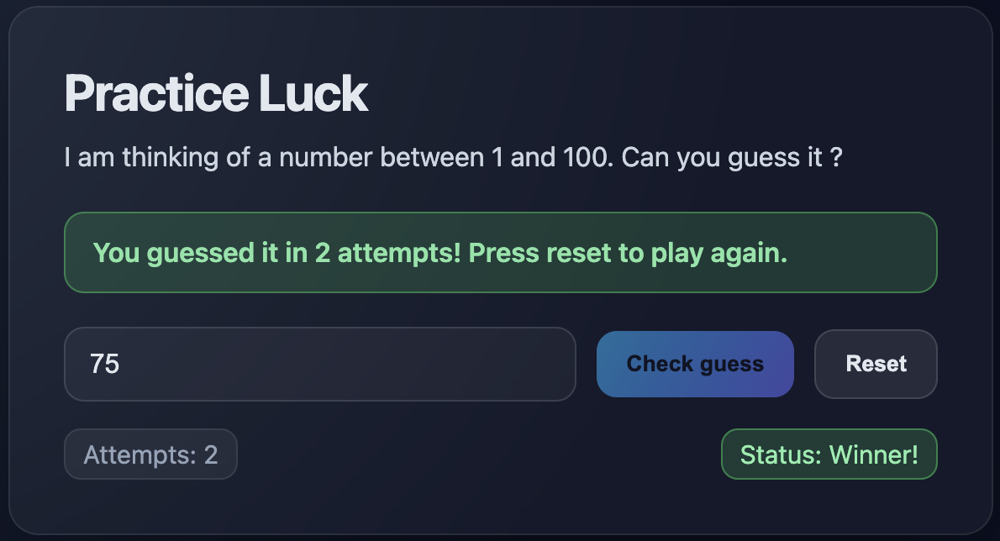

# Practice Luck 🎲

A beautiful number guessing game built entirely in Rust. Experience the joy of full-stack type safety with zero context switching between languages.



## Why Leptos?

**Reactive & Performant** - Fine-grained reactivity means only the DOM elements that change actually re-render. Lightning-fast UIs with minimal overhead, inspired by frameworks like SolidJS.

**WebAssembly Speed** - Compiled to WebAssembly for near-native performance in the browser. Rust's memory safety guarantees and zero-cost abstractions, with zero garbage collection overhead.

**Full-Stack Rust** - Write your entire application in one language. Share code between client and server, maintain type safety everywhere, and eliminate context switching forever.

Learn Rust fundamentals through this [classic guessing game](https://doc.rust-lang.org/book/ch02-00-guessing-game-tutorial.html), now enhanced with [Leptos](https://leptos.dev/) magic!

## How to Play

1. Guess a number between 1 and 100
2. Click "Check guess" for feedback
3. Keep guessing until you win
4. Click "Reset" to start over

## Quick Start

**Prerequisites:** Install Rust, `wasm-pack`, Python 3

```bash
# Build WebAssembly
wasm-pack build --target web --dev

# Start server
python3 -m http.server 8080
```

Open `http://localhost:8080` in your browser.

## Development

**Project Structure:**

```text
├── Cargo.toml          # Rust dependencies
├── src/lib.rs          # Game code (compiled to WASM)
├── index.html          # Browser entry point
├── docs/               # Screenshots
└── pkg/                # Generated WASM files
```

**Making changes:**

1. Edit `src/`
2. Rebuild: `wasm-pack build --target web --dev`
3. Refresh browser

**Adding dependencies:** Edit `Cargo.toml`, then rebuild.

## Troubleshooting

**Port 8080 in use?**

```bash
lsof -i :8080 | grep -v COMMAND | awk '{print $2}' | xargs kill -9
python3 -m http.server 8080
```

**Build fails?**

```bash
rustup target add wasm32-unknown-unknown
cargo clean
wasm-pack build --target web --dev
```

**Changes not showing?** Rebuild and hard refresh.

---

Made with Rust 🦀 & Leptos
